# System Architecture

This document provides a comprehensive overview of the Hyperliquid MACD trading bot architecture, including component descriptions, data flows, design decisions, and technology choices.

## 🏗️ System Overview

The trading bot is a distributed system designed for high-reliability cryptocurrency trading with enterprise-grade features including resilience, monitoring, and security.


## 🧩 Component Descriptions

### Core Components

#### Trading Bot (`trading_bot.py`)
**Purpose**: Main orchestration engine that coordinates all trading activities.

**Responsibilities**:
- Market data collection and processing
- Strategy signal generation and execution
- Risk management and position sizing
- State persistence and recovery
- Integration with all subsystems

**Key Classes**:
- `TradingBot`: Main bot class with trading loop
- `PositionManager`: Position tracking and lifecycle management
- `OrderManager`: Order placement and tracking

#### Enhanced MACD Strategy (`macd_strategy_enhanced.py`)
**Purpose**: Advanced trading strategy with multiple filters and market analysis.

**Features**:
- Multi-timeframe trend confirmation
- Volume analysis and surge detection
- Volatility filtering (ATR, Bollinger Bands)
- Market regime detection (ADX-based)
- Adaptive parameter adjustment
- Risk-adjusted position sizing

**Key Methods**:
- `check_entry_signal()`: Multi-filter entry signal generation
- `check_exit_signal()`: Exit condition evaluation
- `calculate_indicators()`: Technical indicator computation
- `get_market_condition()`: Market regime analysis

#### Hyperliquid Client (`hyperliquid_client.py`)
**Purpose**: Exchange API integration with comprehensive error handling.

**Features**:
- REST API and WebSocket connectivity
- EIP-712 signature generation
- Rate limiting and request batching
- Automatic failover and reconnection
- Response validation and error handling

**Key Methods**:
- `place_order()`: Order execution with validation
- `get_positions()`: Position data retrieval
- `get_account_info()`: Balance and account information
- `cancel_order()`: Order cancellation

### Resilience Layer

#### Resilience Manager (`resilience.py`)
**Purpose**: System reliability and automatic recovery orchestration.

**Features**:
- Circuit breaker pattern implementation
- Exponential backoff with jitter
- Graceful degradation modes
- Emergency shutdown procedures
- Data validation and sanity checks

**Key Components**:
- `CircuitBreaker`: API failure prevention
- `RetryBudget`: Rate limiting for retries
- `BlackBoxRecorder`: Event logging for forensics
- `StateManager`: Persistent state management

#### Watchdog Process (`watchdog.py`)
**Purpose**: Independent monitoring and recovery system.

**Features**:
- Process health monitoring
- Automatic restart on failure
- Emergency position closure
- Resource usage tracking
- Independent logging and alerting

### State Management

#### State Manager (`resilience.py`)
**Purpose**: Persistent state storage with atomic transactions.

**Features**:
- SQLite WAL mode for performance
- Atomic state updates
- Crash recovery and reconciliation
- Position and trade history
- Configuration persistence

**Database Schema**:
```sql
-- Bot state persistence
CREATE TABLE bot_state (
    key TEXT PRIMARY KEY,
    value TEXT,
    updated_at TIMESTAMP
);

-- Position tracking
CREATE TABLE positions (
    position_id TEXT PRIMARY KEY,
    symbol TEXT,
    side TEXT,
    quantity REAL,
    entry_price REAL,
    current_price REAL,
    stop_loss REAL,
    take_profit REAL,
    entry_time TIMESTAMP,
    last_update TIMESTAMP,
    status TEXT,
    pnl REAL,
    metadata TEXT
);

-- Trade history
CREATE TABLE trades (
    trade_id TEXT PRIMARY KEY,
    position_id TEXT,
    symbol TEXT,
    side TEXT,
    quantity REAL,
    entry_price REAL,
    exit_price REAL,
    pnl REAL,
    entry_time TIMESTAMP,
    exit_time TIMESTAMP,
    exit_reason TEXT,
    commission REAL,
    metadata TEXT
);
```

### Monitoring & Alerting

#### Metrics Collector (`metrics.py`)
**Purpose**: Prometheus-compatible metrics collection.

**Metrics Categories**:
- **Trading Metrics**: trades_total, win_rate, pnl_total
- **Performance Metrics**: api_latency, order_execution_time
- **System Metrics**: memory_usage, cpu_usage, websocket_connected
- **Risk Metrics**: current_drawdown, daily_loss_pct
- **Strategy Metrics**: signals_generated, entry_conditions_met

#### Alert Manager (`alerting.py`)
**Purpose**: Multi-channel notification system.

**Alert Channels**:
- **Telegram**: Instant mobile notifications
- **Email**: SMTP-based notifications
- **Discord**: Team channel integration
- **PagerDuty**: Critical incident management

**Alert Severities**:
- **CRITICAL**: Immediate action required (bot crash, position loss)
- **WARNING**: Review within 30 minutes (high latency, memory usage)
- **INFO**: Daily digest (performance summaries)

### Security Components

#### Key Storage (`secure_key_storage.py`)
**Purpose**: Encrypted private key management.

**Features**:
- AES-GCM encryption at rest
- Secure key generation and validation
- Emergency key zeroization
- Access logging and audit trails

#### Audit Logger (`audit_logger.py`)
**Purpose**: Comprehensive security event logging.

**Logged Events**:
- Authentication attempts
- API calls and responses
- Configuration changes
- Position modifications
- Error conditions

#### Input Validator (`input_sanitizer.py`)
**Purpose**: Input validation and sanitization.

**Validation Types**:
- Parameter range checking
- Type validation
- SQL injection prevention
- XSS protection

## 🔄 Data Flow Diagrams

### Trading Signal Flow


### Resilience Recovery Flow

```mermaid
stateDiagram-v2
    [*] --> Normal: Startup
    Normal --> Degraded: Component Failure
    Degraded --> Critical: API Failure
    Critical --> Emergency: State Corruption
    Emergency --> [*]: Manual Recovery

    Normal --> Normal: Recovery
    Degraded --> Normal: Component Restored
    Critical --> Degraded: API Restored

    note right of Degraded
        WebSocket → REST polling
        Cached data usage
        Reduced position sizes
    end note

    note right of Critical
        Minimal functionality
        Conservative trading
        Enhanced monitoring
    end note

    note right of Emergency
        Complete shutdown
        Position preservation
        Manual intervention required
    end note
```



### Monitoring Data Flow


## 🏛️ Design Decisions & Rationale

### Technology Stack Choices

#### Python 3.11+
**Rationale**:
- Superior asyncio performance for concurrent operations
- Enhanced type hinting and pattern matching
- Better error handling and debugging
- Rich ecosystem for data science and trading

#### SQLite with WAL Mode
**Rationale**:
- ACID compliance for state integrity
- WAL mode prevents corruption during crashes
- No external dependencies
- Sufficient performance for trading data volumes

#### WebSocket + REST Architecture
**Rationale**:
- WebSocket for real-time market data
- REST API for reliable order execution
- Automatic fallback ensures continuous operation
- Circuit breaker prevents cascade failures

### Architectural Patterns

#### Circuit Breaker Pattern
**Why**: Prevents system overload during API outages
**Implementation**: Custom CircuitBreaker class with exponential backoff
**Benefits**: Automatic recovery, reduced error rates, improved reliability

#### Observer Pattern (Monitoring)
**Why**: Decoupled monitoring and alerting system
**Implementation**: Event-driven metrics collection and alerting
**Benefits**: Extensible, non-blocking, comprehensive coverage

#### State Machine (Resilience)
**Why**: Clear degradation and recovery states
**Implementation**: Enum-based state management with transitions
**Benefits**: Predictable behavior, easy debugging, controlled degradation

### Resilience Design Principles

#### Defense in Depth
- Multiple validation layers (input, API response, business logic)
- Circuit breakers at API boundaries
- Retry budgets to prevent infinite loops
- Emergency shutdown procedures

#### Fail Fast, Recover Quickly
- Immediate validation of all inputs
- Fast failure detection and alerting
- Automatic recovery mechanisms
- Minimal downtime through redundancy

#### Observable by Default
- Comprehensive metrics collection
- Structured logging with correlation IDs
- Black box event recording
- Health check endpoints

### Performance Optimizations

#### Async/Await Pattern
- Non-blocking API calls
- Concurrent data fetching
- Improved responsiveness
- Better resource utilization

#### Connection Pooling
- Reuse HTTP connections
- Reduced latency
- Lower resource usage
- Better rate limit management

#### Caching Strategy
- Multi-level caching (memory, disk, Redis optional)
- TTL-based expiration
- Cache warming on startup
- Intelligent cache invalidation

## 📊 Module Dependencies


## 🔧 Technology Stack Justification

### Core Technologies

| Component | Technology | Justification |
|-----------|------------|---------------|
| **Language** | Python 3.11+ | Excellent async support, rich ecosystem, data science libraries |
| **Database** | SQLite WAL | ACID compliance, no external dependencies, crash-resistant |
| **Web Framework** | Flask | Lightweight, extensive middleware, production-ready |
| **Metrics** | Prometheus Client | Industry standard, rich query language, Grafana integration |
| **Logging** | Structured JSON | Easy parsing, correlation IDs, searchable |
| **Testing** | unittest + pytest | Built-in, extensive ecosystem, CI/CD integration |

### Cryptocurrency-Specific Technologies

| Component | Technology | Justification |
|-----------|------------|---------------|
| **Exchange API** | Custom Hyperliquid Client | Full control, optimized for specific exchange, comprehensive error handling |
| **WebSocket** | websockets library | Python asyncio native, excellent performance, robust reconnection |
| **Wallet Signing** | eth-account + web3 | Industry standard Ethereum libraries, secure key management |
| **Price Data** | pandas + numpy | High-performance data manipulation, vectorized operations |

### Enterprise Features

| Component | Technology | Justification |
|-----------|------------|---------------|
| **Resilience** | Custom Circuit Breaker | Tailored to trading requirements, comprehensive failure handling |
| **Security** | AES-GCM Encryption | Military-grade encryption, secure key zeroization |
| **Monitoring** | Multi-channel Alerting | Critical for 24/7 trading, multiple notification methods |
| **State Management** | SQLite Transactions | Atomic operations, crash recovery, data integrity |

## 🚀 Scaling Considerations

### Vertical Scaling
- **Memory**: 4GB+ recommended for large datasets
- **CPU**: Multi-core for parallel processing
- **Storage**: SSD recommended for database performance
- **Network**: Low-latency connection essential

### Horizontal Scaling
- **Multiple Bots**: Different symbols on separate instances
- **Database Sharding**: Split historical data across databases
- **Load Balancing**: Distribute API calls across multiple IPs
- **Monitoring Aggregation**: Centralized logging and metrics

### Performance Benchmarks

| Operation | Target Latency | Current Performance |
|-----------|----------------|-------------------|
| Signal Generation | <100ms | ~50ms |
| Order Placement | <500ms | ~200ms |
| State Persistence | <50ms | ~20ms |
| Metrics Collection | <10ms | ~5ms |
| Health Check | <100ms | ~30ms |

## 🔒 Security Architecture

### Defense in Depth Layers

1. **Network Layer**: SSL/TLS, API key authentication, rate limiting
2. **Application Layer**: Input validation, parameter sanitization, bounds checking
3. **Data Layer**: Encrypted storage, access logging, integrity checks
4. **Operational Layer**: Audit trails, anomaly detection, emergency procedures

### Key Security Components

- **Encrypted Key Storage**: AES-GCM encryption with secure key derivation
- **API Request Signing**: EIP-712 compliant signature generation
- **Audit Logging**: Comprehensive security event tracking
- **Access Control**: Role-based permissions and API restrictions

## 🧪 Testing Strategy

### Testing Pyramid

```
End-to-End Tests (Integration)
    ↓
Integration Tests (API, Database)
    ↓
Unit Tests (Individual Components)
    ↓
Static Analysis (Code Quality)
```

### Test Categories

- **Unit Tests**: Individual function and class testing
- **Integration Tests**: Component interaction testing
- **End-to-End Tests**: Complete trading workflow testing
- **Performance Tests**: Load testing and benchmarking
- **Resilience Tests**: Failure scenario simulation
- **Security Tests**: Penetration testing and vulnerability assessment

### Continuous Integration

```yaml
# .github/workflows/ci.yml
name: CI/CD Pipeline
on: [push, pull_request]

jobs:
  test:
    runs-on: ubuntu-latest
    steps:
      - uses: actions/checkout@v3
      - name: Set up Python
        uses: actions/setup-python@v4
        with:
          python-version: '3.11'
      - name: Install dependencies
        run: pip install -r requirements.txt -r requirements-dev.txt
      - name: Run tests
        run: python run_tests.py
      - name: Run security checks
        run: bandit -r . --exclude ./venv
```

## 📈 Future Evolution

### Planned Enhancements

#### Phase 1: Performance Optimization
- Redis caching layer for high-frequency data
- GPU acceleration for indicator calculations
- Async database operations
- Connection multiplexing

#### Phase 2: Advanced Features
- Machine learning signal enhancement
- Multi-exchange arbitrage
- Options trading integration
- Portfolio optimization algorithms

#### Phase 3: Enterprise Features
- Multi-tenant architecture
- Advanced risk analytics
- Regulatory compliance reporting
- Institutional-grade audit trails

### Architecture Evolution


This architecture provides a solid foundation for continuous evolution while maintaining reliability and performance standards.
